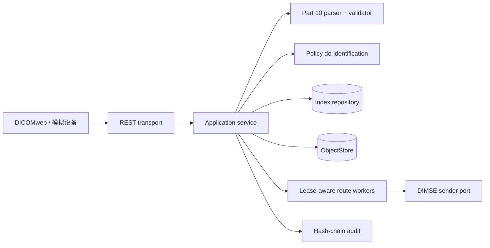

# DICOM Imaging Gateway

企业级纯 Go DICOM Part 10 影像交换网关示例。服务接收本地模拟设备或 DICOMweb STOW-RS 请求，执行安全解析、实例幂等归档、UID 映射、去标识化、路由排队和审计链记录。真实 DIMSE/对象存储通过端口替换，默认使用本地对象存储和模拟发送器形成可启动闭环。

## 快速启动

```bash
go test ./...
go test -race ./...
go vet ./...
go build ./...
go run ./cmd/dicom-gateway
```

另一个终端运行 `scripts/smoke.sh`。默认监听 `:8080`，对象存储写入 `./data`。环境变量 `DICOM_HTTP_ADDR`、`DICOM_DATA_DIR`、`DICOM_MAX_ELEMENT_BYTES`、`DICOM_MAX_FILE_BYTES`、`DICOM_WORKERS` 可覆盖配置。

## API

- `POST /api/v1/ingest/validate`：解析并校验 DICOM Part 10。
- `POST /api/v1/ingest` 或 `POST /dicomweb/studies`：幂等归档实例并按路由规则创建作业。
- `GET /api/v1/instances?cursor=&limit=`：实例游标查询。
- `GET /api/v1/instances/{uid}`：元数据查询。
- `POST /api/v1/instances/{uid}/deidentify`：按 JSON 策略执行删除、替换、哈希和日期平移。
- `GET/POST /api/v1/destinations`、`GET /api/v1/jobs`、`GET /api/v1/audit/export`。
- `GET /healthz`、`GET /readyz`。

## 架构



状态机：`idle -> negotiating -> established -> releasing -> closed`（DIMSE 关联）；路由作业：`queued -> running -> succeeded`，失败后 `retrying -> dead_letter`。所有解析都受文件、元素、分片和 Pixel Data 上限保护；未注册 codec 明确返回错误，不执行外部命令。

生产化替换点：将内存 repository 替换为 PostgreSQL 事务实现，将 LocalStore 替换为带分块校验和断点续传的对象存储，将模拟发送器替换为带关联超时/重试/熔断的 DIMSE 适配器。数据库只保存索引和摘要，像素保留在对象端口。
